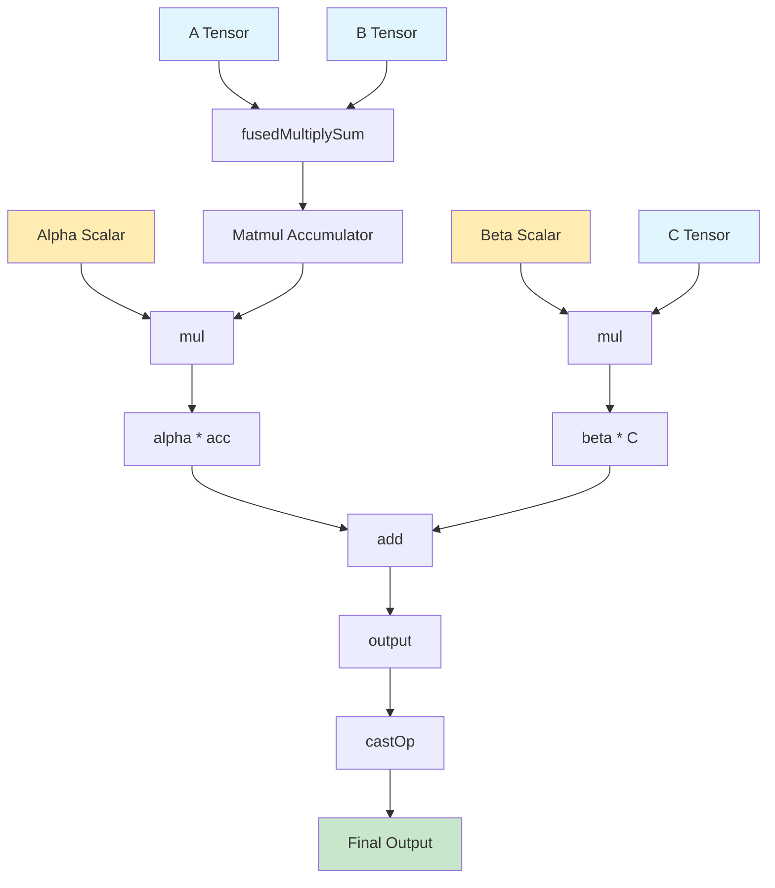
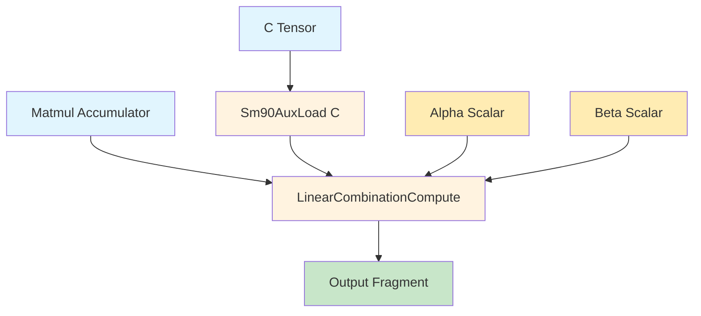
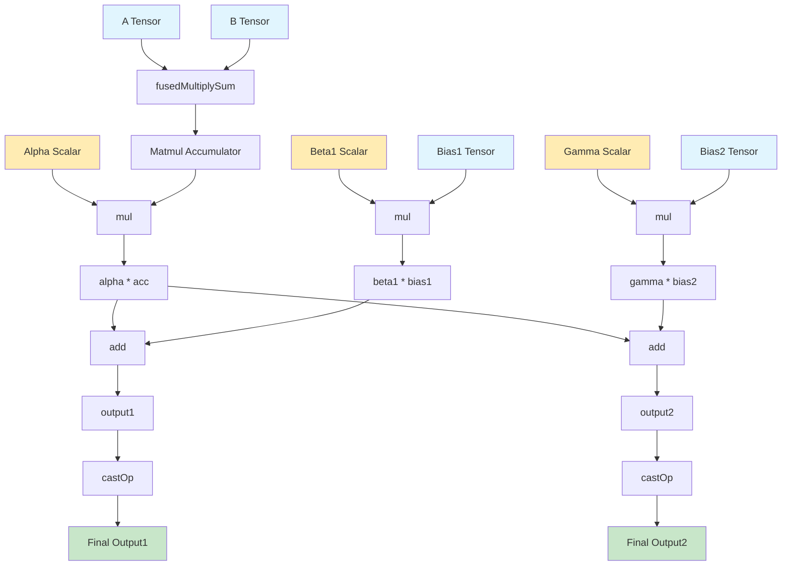
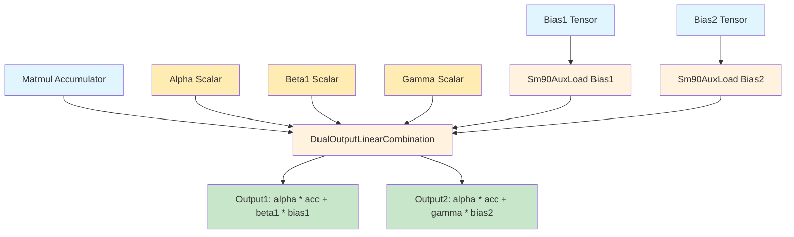

# NVFuser to Cutlass EVT Translation Strategy

## Table of Contents

1. [Introduction](#1-introduction)
   - 1.1 [Key Concepts](#11-key-concepts)
   - 1.2 [Motivation](#12-motivation)
2. [Overview of Translation Strategy](#2-overview-of-translation-strategy)
   - 2.1 [High-Level Approach](#21-high-level-approach)
   - 2.2 [Runtime Code Generation Strategy](#22-runtime-code-generation-strategy)
3. [Example nvFuser Pattern](#3-example-nvfuser-pattern)
   - 3.1 [Basic Linear Operations](#31-basic-linear-operations)
4. [EVT Node Translation](#4-evt-node-translation)
   - 4.1 [Operation Mapping Table](#41-operation-mapping-table)
   - 4.2 [Custom Operation Translation](#42-custom-operation-translation)
   - 4.3 [Multiple Aux Inputs and Outputs Example](#43-multiple-aux-inputs-and-outputs-example)
5. [Fusion Operation Mapping](#5-fusion-operation-mapping)
   - 5.1 [nvFuser to EVT Translation Rules](#51-nvfuser-to-evt-translation-rules)
   - 5.2 [Memory Layout Translation](#52-memory-layout-translation)
   - 5.3 [Data Type Translation](#53-data-type-translation)
6. [Advanced Patterns](#6-advanced-patterns)
   - 6.1 [Multi-Stage Epilogues](#61-multi-stage-epilogues)
   - 6.2 [Conditional Operations](#62-conditional-operations)
   - 6.3 [Reduction Patterns](#63-reduction-patterns)
7. [Implementation Strategy](#7-implementation-strategy)
   - 7.1 [Integration with nvFuser](#71-integration-with-nvfuser)
   - 7.2 [Runtime Compilation](#72-runtime-compilation)
   - 7.3 [Performance Optimization](#73-performance-optimization)
8. [Questions and Ambiguities](#8-questions-and-ambiguities)
   - 8.1 [Architecture and Compatibility](#81-architecture-and-compatibility)
   - 8.2 [Performance and Optimization](#82-performance-and-optimization)
   - 8.3 [Implementation Details](#83-implementation-details)
   - 8.4 [Advanced Features](#84-advanced-features)
   - 8.5 [Integration and Deployment](#85-integration-and-deployment)

---

## 1. Introduction

This document outlines a strategy for translating epilogue operations from nvFuser fusion graphs to Cutlass Epilogue Visitor Trees (EVT). The goal is to enable nvFuser to generate optimized GEMM kernels that leverage Cutlass's sophisticated epilogue fusion capabilities while maintaining nvFuser's high-level fusion abstractions.

### 1.1 Key Concepts

- **nvFuser**: Deep learning compiler that generates fused CUDA kernels
- **Cutlass EVT**: Epilogue Visitor Tree pattern for composable epilogue operations
- **Runtime Code Generation**: Dynamic C++ code generation at kernel compilation time
- **Epilogue Fusion**: Post-GEMM operations like bias addition, activation functions, and reductions

### 1.2 Motivation

By translating nvFuser epilogue operations to Cutlass EVT patterns, we can:
- Leverage Cutlass's highly optimized epilogue implementations
- Maintain nvFuser's high-level fusion abstractions
- Enable sophisticated epilogue patterns (bias + activation, reductions, etc.)
- Generate code that targets modern GPU architectures (Hopper, Blackwell)

---

## 2. Overview of Translation Strategy

### 2.1 High-Level Approach

The translation strategy involves three main phases:

1. **Analysis Phase**: Parse nvFuser fusion graph to identify epilogue operations
2. **Translation Phase**: Map nvFuser operations to Cutlass EVT patterns
3. **Code Generation Phase**: Generate C++ code that constructs the appropriate EVT

### 2.2 Runtime Code Generation Strategy

The system will generate C++ code at runtime that:
- Defines custom EVT node types when needed
- Constructs EVT trees using Cutlass's builder patterns
- Integrates with Cutlass's CollectiveBuilder for kernel generation
- Handles parameter passing and memory management

---

## 3. Example nvFuser Pattern

### 3.1 Basic Linear Operations

**nvFuser Fusion Flow:**


**nvFuser Pattern:**
```cpp
// nvFuser fusion operation
// acc is the matmul result and C is a bias tensor
TensorView* A = TensorViewBuilder().shape({-1, 1, -1}).dtype(DataType::BFloat16);
TensorView* B = TensorViewBuilder().shape({1, -1, -1}).dtype(DataType::BFloat16);
fusion->addInput(A);
fusion->addInput(B);
fusion->addInput(C);
TensorView* acc = fusedMultiplySum(A, B, {-1});
TensorView* alpha_acc = mul(alpha, ElementScalar);
TensorView* beta_C = mul(beta, C);
// output = alpha * acc + beta * C;
TensorView* output = add(alpha_acc, beta_C);
TensorView* output_bf16 = castOp(DataType::BFloat16, output);
fusion->addOutput(output_bf16);
```

---

## 4. EVT Node Translation

### 4.1 Operation Mapping Table

| nvFuser Operation | Cutlass EVT Pattern | Generated Code Type |
|-------------------|---------------------|-------------------|
| `LinearOp` | `LinComb` | Built-in |
| `BiasOp` | `LinCombPerRowBias` | Built-in |
| `ReLU` | `LinCombEltAct<ReLU>` | Built-in |
| `GELU` | `LinCombEltAct<GELU>` | Built-in |
| `Residual` | `LinCombResidual` | Built-in |
| `Reduction` | `Sm90ScalarReduction` | Built-in |
| `CustomOp` | Custom EVT Node | Generated |

### 4.2 Custom Operation Translation

For operations not available in Cutlass, the system generates custom EVT nodes:

**nvFuser Pattern:**
```cpp
// nvFuser fusion operation with custom operation
TensorView* A = TensorViewBuilder().shape({-1, 1, -1}).dtype(DataType::BFloat16);
TensorView* B = TensorViewBuilder().shape({1, -1, -1}).dtype(DataType::BFloat16);
fusion->addInput(A);
fusion->addInput(B);
TensorView* acc = fusedMultiplySum(A, B, {-1});
// Epilogue is acc * alpha + beta * C
Val* alpha = IrBuilder::create<Val>(DataType::Float);
Val* beta = IrBuilder::create<Val>(DataType::Float);
fusion->addInput(alpha);
fusion->addInput(beta);
// Custom operation: output = custom_operation(acc, param1, param2)
TensorView* alpha_acc = mul(alpha, acc);
TensorView* beta_C = mul(beta, C);
TensorView* output = add(alpha_acc, beta_C);
TensorView* output_bf16 = castOp(DataType::BFloat16, output);
fusion->addOutput(output_bf16);
```

**nvFuser Fusion Flow:**


**Generated C++ Code:**
```cpp
// Better approach using Cutlass EVT framework for: output = alpha * acc + beta * C
// This leverages Sm90AuxLoad for automatic fragment loading

// 1. Define the auxiliary load operation
using AuxLoadC = cutlass::epilogue::fusion::Sm90AuxLoad<
    Stages, EpilogueTile, ElementCompute, StrideMNL, SmemLayoutAtom, CopyOpS2R>;

// 2. Define the computation operation
template<typename ElementCompute>
struct LinearCombinationCompute {
    struct Arguments {
        ElementCompute alpha;
        ElementCompute beta;
    };
    
    Arguments args_;
    
    template<typename ElementAccumulator, int FragmentSize>
    CUTLASS_DEVICE Array<ElementCompute, FragmentSize>
    visit(Array<ElementAccumulator, FragmentSize> const& frg_acc, 
          Array<ElementCompute, FragmentSize> const& frg_C,  // Automatically loaded by Sm90AuxLoad
          int epi_v, int epi_m, int epi_n) {
        Array<ElementCompute, FragmentSize> result;
        
        // Perform: result = alpha * acc + beta * C
        // C fragment is automatically loaded by the EVT framework
        for (int i = 0; i < FragmentSize; ++i) {
            result[i] = args_.alpha * frg_acc[i] + args_.beta * frg_C[i];
        }
        return result;
    }
};

// 3. Compose the complete EVT
using EVTOp = cutlass::epilogue::fusion::Sm90EVT<
    LinearCombinationCompute<ElementCompute>,
    AuxLoadC
>;

// 4. Usage in epilogue arguments
typename EVTOp::Arguments epilogue_args{
    .alpha = alpha,
    .beta = beta,
    .ptr_aux = C_ptr,        // Sm90AuxLoad automatically handles this
    .dAux = C_stride         // Sm90AuxLoad automatically handles this
};
```

**EVT Flow:**


### 4.3 Multiple Aux Inputs and Outputs Example

**nvFuser Fusion Flow:**


**nvFuser Pattern:**
```cpp
// nvFuser fusion operation with two aux inputs and two outputs
// acc is the matmul result, bias1 and bias2 are auxiliary tensors
TensorView* A = TensorViewBuilder().shape({-1, 1, -1}).dtype(DataType::BFloat16);
TensorView* B = TensorViewBuilder().shape({1, -1, -1}).dtype(DataType::BFloat16);
fusion->addInput(A);
fusion->addInput(B);
fusion->addInput(bias1);
fusion->addInput(bias2);
TensorView* acc = fusedMultiplySum(A, B, {-1});
TensorView* alpha_acc = mul(alpha, acc);
TensorView* beta_bias1 = mul(beta1, bias1);
TensorView* gamma_bias2 = mul(gamma, bias2);
// output1 = alpha * acc + beta1 * bias1
TensorView* output1 = add(alpha_acc, beta_bias1);
// output2 = alpha * acc + gamma * bias2
TensorView* output2 = add(alpha_acc, gamma_bias2);
TensorView* output1_bf16 = castOp(DataType::BFloat16, output1);
TensorView* output2_bf16 = castOp(DataType::BFloat16, output2);
fusion->addOutput(output1_bf16);
fusion->addOutput(output2_bf16);
```

**Generated C++ Code:**
```cpp
// Example based on Cutlass patterns from:
// https://github.com/NVIDIA/cutlass/blob/main/test/unit/gemm/device/sm90_gemm_f16_f16_f16_tensor_op_f32_cluster_warpspecialized_cooperative_bias_elementwise.cu#L165
// https://github.com/NVIDIA/cutlass/blob/main/test/unit/gemm/device/sm90_gemm_f16_f16_f16_tensor_op_f32_cluster_warpspecialized_cooperative_bias_elementwise.cu#L298

// EVT approach with two aux inputs and two outputs
// 1. Define auxiliary load operations for both bias tensors
using AuxLoadBias1 = cutlass::epilogue::fusion::Sm90AuxLoad<
    Stages, EpilogueTile, ElementCompute, StrideMNL, SmemLayoutAtom, CopyOpS2R>;
using AuxLoadBias2 = cutlass::epilogue::fusion::Sm90AuxLoad<
    Stages, EpilogueTile, ElementCompute, StrideMNL, SmemLayoutAtom, CopyOpS2R>;

// 2. Define the computation operation with two outputs
template<typename ElementCompute>
struct DualOutputLinearCombination {
    struct Arguments {
        ElementCompute alpha;
        ElementCompute beta1;
        ElementCompute gamma;
    };
    
    Arguments args_;
    
    template<typename ElementAccumulator, int FragmentSize>
    CUTLASS_DEVICE auto
    visit(Array<ElementAccumulator, FragmentSize> const& frg_acc, 
          Array<ElementCompute, FragmentSize> const& frg_bias1,  // From AuxLoadBias1
          Array<ElementCompute, FragmentSize> const& frg_bias2,  // From AuxLoadBias2
          int epi_v, int epi_m, int epi_n) {
        
        // Create output fragments
        Array<ElementCompute, FragmentSize> result1;
        Array<ElementCompute, FragmentSize> result2;
        
        // Perform computations for both outputs
        for (int i = 0; i < FragmentSize; ++i) {
            // output1 = alpha * acc + beta1 * bias1
            result1[i] = args_.alpha * frg_acc[i] + args_.beta1 * frg_bias1[i];
            // output2 = alpha * acc + gamma * bias2
            result2[i] = args_.alpha * frg_acc[i] + args_.gamma * frg_bias2[i];
        }
        
        // Return tuple of both outputs
        return cute::make_tuple(result1, result2);
    }
};

// 3. Compose the complete EVT with multiple aux loads
using EVTOp = cutlass::epilogue::fusion::Sm90EVT<
    DualOutputLinearCombination<ElementCompute>,
    AuxLoadBias1,
    AuxLoadBias2
>;

// 4. Usage in epilogue arguments
typename EVTOp::Arguments epilogue_args{
    .alpha = alpha,
    .beta1 = beta1,
    .gamma = gamma,
    .ptr_aux = bias1_ptr,     // For AuxLoadBias1
    .dAux = bias1_stride,
    .ptr_aux2 = bias2_ptr,    // For AuxLoadBias2  
    .dAux2 = bias2_stride
};
```

**EVT Flow:**


---

## 5. Fusion Operation Mapping

### 5.1 nvFuser to EVT Translation Rules

1. **Linear Operations**: Map to `LinComb` patterns
2. **Bias Operations**: Map to `LinCombPerRowBias` or `LinCombPerColBias`
3. **Activation Functions**: Map to `LinCombEltAct` with appropriate activation
4. **Reductions**: Map to `Sm90ScalarReduction`, `Sm90RowReduction`, or `Sm90ColReduction`
5. **Auxiliary Operations**: Map to `Sm90AuxLoad` or `Sm90AuxStore`
6. **Custom Operations**: Generate custom EVT nodes

### 5.2 Memory Layout Translation

```cpp
// Generated memory layout translation
template<typename nvFuser::TensorView>
struct LayoutTranslator {
    using CutlassLayout = cutlass::layout::RowMajor;
    
    static auto translate_layout(const nvFuser::TensorView& tv) {
        // Translate nvFuser layout to Cutlass layout
        auto strides = tv->getStrides();
        auto sizes = tv->getSizes();
        
        return CutlassLayout::packed({sizes[0], sizes[1]});
    }
};
```

### 5.3 Data Type Translation

```cpp
// Generated data type translation
template<typename nvFuser::DataType>
struct DataTypeTranslator {
    using CutlassType = cutlass::half_t; // Default
    
    template<>
    struct DataTypeTranslator<nvFuser::DataType::Float> {
        using CutlassType = float;
    };
    
    template<>
    struct DataTypeTranslator<nvFuser::DataType::Half> {
        using CutlassType = cutlass::half_t;
    };
};
```

---

## 6. Advanced Patterns

### 6.1 Multi-Stage Epilogues

For complex epilogues with multiple stages:

```cpp
// Generated multi-stage EVT
using MultiStageEVT = cutlass::epilogue::fusion::Sm90EVT<
    Stage3Node<ElementCompute>,
    cutlass::epilogue::fusion::Sm90EVT<
        Stage2Node<ElementCompute>,
        cutlass::epilogue::fusion::Sm90EVT<
            Stage1Node<ElementCompute>,
            cutlass::epilogue::fusion::Sm90AccFetch
        >
    >
>;
```

### 6.2 Conditional Operations

For operations with runtime conditions:

```cpp
// Generated conditional EVT
template<typename ElementCompute>
struct ConditionalNode {
    bool condition_;
    
    template<typename ElementAccumulator, int FragmentSize>
    CUTLASS_DEVICE Array<ElementCompute, FragmentSize>
    visit(Array<ElementAccumulator, FragmentSize> const& frg_acc, 
          int epi_v, int epi_m, int epi_n) {
        if (condition_) {
            return operation_a(frg_acc);
        } else {
            return operation_b(frg_acc);
        }
    }
};
```

### 6.3 Reduction Patterns

For complex reduction patterns:

```cpp
// Generated reduction EVT
using ReductionEVT = cutlass::epilogue::fusion::Sm90EVT<
    cutlass::epilogue::fusion::Sm90ScalarReduction<
        cutlass::epilogue::thread::Sum,
        cutlass::epilogue::thread::AtomicAdd,
        ElementOutput, ElementCompute
    >,
    cutlass::epilogue::fusion::Sm90EVT<
        cutlass::epilogue::fusion::LinComb<
            ElementCompute, ElementCompute, ElementC, ElementScalar>,
        cutlass::epilogue::fusion::Sm90AccFetch
    >
>;
```

---

## 7. Implementation Strategy

### 7.1 Integration with nvFuser

1. **Analysis Phase**: Add EVT analysis to nvFuser's fusion graph analysis
2. **Translation Phase**: Implement translation logic in nvFuser's code generation
3. **Code Generation Phase**: Extend nvFuser's C++ code generation to include EVT patterns

### 7.2 Runtime Compilation

```cpp
// Generated runtime compilation code
class EVTCompiler {
public:
    static std::unique_ptr<CompiledKernel> compile_evt_kernel(
        const nvFuser::Fusion& fusion,
        const std::string& generated_code) {
        
        // Compile the generated C++ code
        auto compiled_kernel = compile_cuda_kernel(generated_code);
        
        // Return compiled kernel with EVT integration
        return std::make_unique<EVTCompiledKernel>(compiled_kernel);
    }
};
```

### 7.3 Performance Optimization

1. **Pattern Recognition**: Identify common patterns for optimized EVT construction
2. **Memory Optimization**: Optimize memory layouts for EVT operations
3. **Kernel Fusion**: Maximize fusion opportunities within EVT patterns

---

## 8. Questions and Ambiguities

### 8.1 Architecture and Compatibility

1. **GPU Architecture Support**: What is the minimum GPU architecture required for EVT support? Are there limitations for older architectures (pre-Hopper)?

2. **nvFuser Integration**: How deeply should EVT translation be integrated into nvFuser's existing fusion graph analysis? Should it be a separate pass or integrated into the main analysis pipeline?

3. **Backward Compatibility**: How should this system handle nvFuser operations that don't have direct EVT equivalents? Should we fall back to traditional nvFuser code generation?

### 9.2 Performance and Optimization

4. **Performance Overhead**: What is the expected performance overhead of generating EVT code at runtime versus using pre-compiled patterns?

5. **Memory Layout Optimization**: How should we handle complex memory layouts that don't directly map to Cutlass's layout system?

6. **Kernel Fusion Limits**: What are the practical limits on the complexity of EVT patterns that can be efficiently generated and compiled?

### 9.3 Implementation Details

7. **Custom Operation Support**: For nvFuser operations that don't have Cutlass equivalents, what is the preferred approach for generating custom EVT nodes? Should we generate inline CUDA code or use Cutlass's extension mechanisms?

8. **Parameter Passing**: How should we handle complex parameter passing between nvFuser operations and generated EVT nodes? What about dynamic parameters that are only known at runtime?

9. **Error Handling**: What should be the error handling strategy for cases where EVT translation fails or generates invalid code?

### 9.4 Advanced Features

10. **Conditional Operations**: How should we handle nvFuser operations with runtime conditions that affect the epilogue structure?

11. **Multi-GPU Support**: How should EVT translation work in multi-GPU scenarios where different GPUs might have different capabilities?

12. **Debugging and Profiling**: What debugging and profiling capabilities should be built into the EVT translation system?

### 9.5 Integration and Deployment

13. **Build System Integration**: How should the EVT code generation integrate with nvFuser's existing build system and dependency management?

14. **Testing Strategy**: What testing approach should be used to validate EVT translation correctness and performance?

15. **Documentation and Maintenance**: How should we document the translation patterns and maintain compatibility as both nvFuser and Cutlass evolve?

---

## References

- [Epilogue Visitor Trees in CUTLASS](https://research.colfax-intl.com/epilogue_visitor_tree/)
- [CUTLASS Documentation](https://github.com/NVIDIA/cutlass)
- [nvFuser Source Code](https://github.com/NVIDIA/Fuser) 